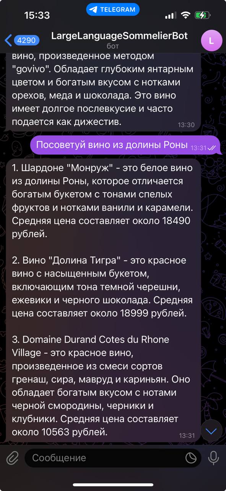
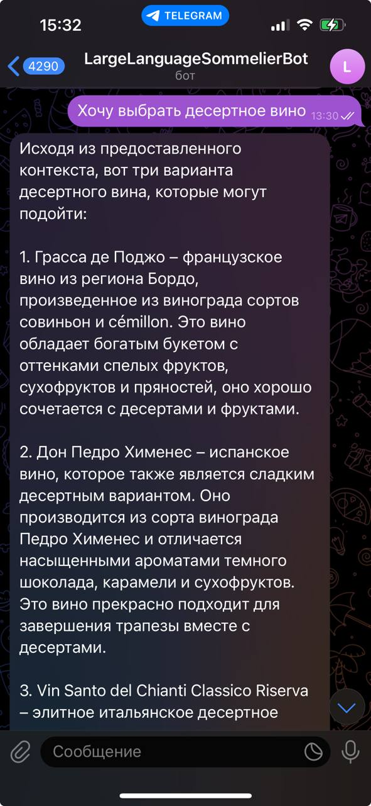

# Large Language Sommelier 🍷

## About the project

AI sommelier is your personal wine expert powered by large language models with RAG (Retrieval Augmented Generation) capabilities. The project includes both an API service and a Telegram bot for wine recommendations.

## Description

Large Language Sommelier helps you choose the perfect wine, taking into account many factors:
- Compatibility with dishes
- Preferences according to taste
- Price range
- A reason to choose a wine

## Project Structure
```
repo/
├── src/
│   ├── api/
│   │   ├── main.py          # FastAPI application
│   │   └── services.py      # Recommendation service
│   ├── core/
│   │   ├── config.py        # Configuration settings
│   │   └── models.py        # Pydantic models
│   ├── retriever/
│   │   └── splitter.py      # Document processing
│   ├── utils/
│   │   └── loaders.py       # Model loading utilities
│   └── main.py              # Application entry point
├── validation/              # Validation framework
└── data/                    # Data directory
```

## Features
- Wine recommendation based on user queries
- Support for multiple LLM backends (Ollama, GigaChat)
- Retrieval-augmented generation for accurate recommendations
- Telegram bot interface
- Comprehensive validation framework

## Data
- A table with the wines presented in the assortment. It includes the following information: name, average price,tasting characteristics, interesting facts, aging method, fermentation method.
- Buyer's Wine Guide, Robert Parker - A complete, easy-to-use guide to over 8,000 wines from the main wine regions from the author and publisher of The Wine Advocate.

## Getting Started

### Prerequisites
- Python 3.8+
- FastAPI
- Langchain
- Ollama or GigaChat credentials

### Installation
```bash
# Clone the repository
git clone <repository-url>
cd large-language-sommelier

# Install dependencies
pip install -r requirements.txt

# Set up environment variables
cp .env.example .env
# Edit .env with your credentials
```

### Running the API

The API service can be started using [`src/main.py`](src/main.py):

```bash
python src/main.py
```

The API will be available at `http://localhost:8000`

### API Endpoints

#### Wine Recommendation
```bash
curl -X POST "http://localhost:8000/recommend/" \
  -H "Content-Type: application/json" \
  -d '{
    "question": "Посоветуйте красное сухое вино",
    "model_choice": {
      "model_server": "ollama",
      "model_name": "gemma:2b-instruct-fp16"
    }
  }'
```

#### Python Example
```python
import requests

BASE_URL = "http://localhost:8000"
endpoint = f"{BASE_URL}/recommend/"
payload = {
    "question": "Какое вино подойдет к рыбе?",
    "model_choice": {
        "model_server": "ollama",
        "model_name": "gemma:2b-instruct-fp16"
    }
}

try:
    response = requests.post(
        endpoint,
        json=payload,
        headers={"Content-Type": "application/json"}
    )
    response.raise_for_status()
    result = response.json()
    print(result)
except requests.exceptions.RequestException as e:
    print(f"Error making request: {e}")
```

### Running the Telegram Bot

To start the Telegram bot [`app.py`](./app.py):

```bash
python app.py
```

The bot supports the following commands:
- `/start` - Initiates conversation with welcome message
- `/help` - Shows available bot capabilities

## Validation Framework

The project includes a comprehensive validation framework located in the `validation/` directory. It provides tools for:
- Automated testing of RAG system responses
- Collection of performance and quality metrics
- LLM-based evaluation of responses
- Integration with Langfuse for metrics tracking
- Web-based UI for running tests and viewing results

For detailed information about the validation framework, please refer to [`validation/README.md`](./validation/README.md).

## Configuration

The system can be configured through environment variables or the config file [config.py](src/core/config.py). Key configurations include:

```python
GIGACHAT_CREDENTIALS="your-credentials"
MODEL_SERVER="ollama"
MODEL_NAME="your-model"
OLLAMA_API_BASE="http://localhost:11434"
EMBEDDING_MODEL_NAME="intfloat/multilingual-e5-small"
```

## Telegram bot examples



## The project team
- Arseny Kazantcev - Data Scientist
- Alexander Sesorov - ML Engineer & QA