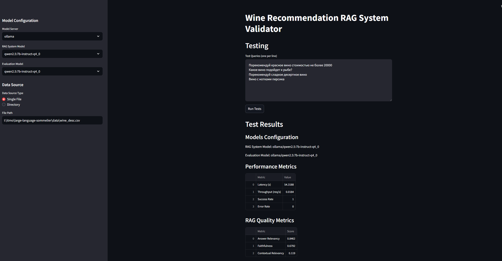

Here's a comprehensive README.md for the validation project:

# RAG System Validation Framework

A comprehensive framework for testing and validating Retrieval-Augmented Generation (RAG) systems with metrics collection, LLM-based evaluation, and Streamlit UI integration.

## Overview



This validation framework provides tools for:
- Automated testing of RAG system responses
- Collection of performance and quality metrics
- LLM-based evaluation of responses
- Integration with Langfuse for metrics tracking
- Web-based UI for running tests and viewing results

## Project Structure

```
validation/
├── core/
│   ├── metrics.py      # Metrics collection and evaluation
│   └── tester.py       # RAG system testing functionality
├── utils/
│   └── ollama_api.py   # Ollama LLM integration utilities
└── ui/
    └── app.py          # Streamlit-based user interface
```

## Features

### RAG System Testing
The `RAGSystemTester` class in [`tester.py`](./core/tester.py) provides capabilities for:
- Single query testing
- Model availability checking
- Data source updates
- Async operations support

### Metrics Collection
The framework collects various metrics through `ValidationMetricsCollector` [metrics.py]:

1. RAG Quality Metrics:
   - Answer Relevancy
   - Faithfulness
   - Contextual Relevancy

2. Performance Metrics:
   - Response time
   - Resource usage
   - Success rates

### LLM Integration
Custom Ollama integration [`ollama_api.py`](./utils/ollama_api.py) supports:
- Multiple model support
- JSON output formatting
- Configurable parameters
- Async generation capabilities

### Web Interface
Streamlit-based UI [`app.py`](./ui/app.py) features:
- Interactive test execution
- Real-time results display
- Model selection (for recommendation and for critic)
- Test query management

## Setup

1. Environment Setup
```bash
# Clone the repository
git clone <repository-url>
cd validation

# Install dependencies
pip install -r requirements.txt
```

2. Environment Variables
```bash
LANGFUSE_PUBLIC_KEY=<your-public-key>
LANGFUSE_SECRET_KEY=<your-secret-key>
```

## Usage

### Running Tests via UI
```bash
cd validation/ui
streamlit run app.py
```

### Code Usage

```python
from core.metrics import ValidationMetricsCollector
from core.tester import RAGSystemTester
from langfuse import Langfuse

# Initialize components
langfuse_client = Langfuse(
    public_key="your_public_key",
    secret_key="your_secret_key"
)
metrics_collector = ValidationMetricsCollector(langfuse_client)

# Create tester instance
async with RAGSystemTester("http://your-rag-system", metrics_collector) as tester:
    # Run single test
    result = await tester.test_single_query(
        query="Your test query",
        model_name="qwen2.5:7b-instruct-q4_0"
    )
```

## Metrics Overview

### Answer Relevancy
Measures how well the response answers the given query:
- Score range: 0.0 - 1.0
- Threshold: 0.5
- Includes detailed reasoning

### Faithfulness
Evaluates response accuracy relative to provided context:
- Score range: 0.0 - 1.0
- Threshold: 0.5
- Context extraction limit: 50 tokens

### Contextual Relevancy
Evaluates the overall relevance of the information presented in provided context for the given query
- Score range: 0.0 - 1.0
- Threshold: 0.5
- Includes detailed reasoning

## Contributing

1. Fork the repository
2. Create your feature branch (`git checkout -b feature/amazing-feature`)
3. Commit your changes (`git commit -m 'Add amazing feature'`)
4. Push to the branch (`git push origin feature/amazing-feature`)
5. Open a Pull Request

## Dependencies

- Streamlit for UI
- Langfuse for metrics tracking
- DeepEval for LLM-based evaluation
- httpx for async HTTP operations
- Ollama for LLM integration